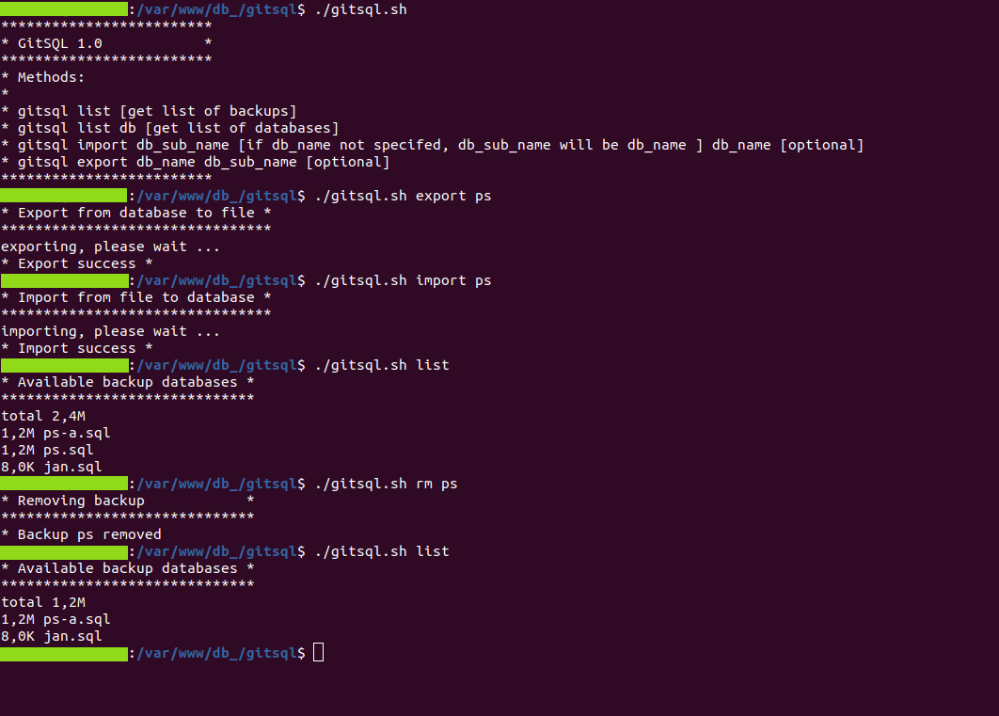

# gitsql tool v1.0.2 (MySQL)

Backup database MySQL from command line (LINUX)

### How it work
Very simple, by run script ./gitsql.sh you get access to commands. Backup-s are stored in the same directory gitsql/db



### Install

Clone repo

```bash
git clone git@github.com:damian-pm/gitsql-tool.git
```
and thats all, now you can run script ``./gitsql-tool/gitsql.sh``

#### (Optional) Make alias
You can move repo to /home dir and create alias
For example in .bash_aliases

```bash
alias gitsql='~/gitsql-tool/gitsql.sh' 
```

### Configuration

Edit file ``gitsql.sh``, rename USER_LOGIN with login to database and USER_PASS with password to database
```bash
USER_LOGIN="damian"
USER_PASS="damian"
PORT=3306
HOST=localhost

# for Linux
PATH_MYSQL="mysql" 
PATH_MYSQL_DUMP="mysqldump"

# for Windows
# PATH_MYSQL="mysql.exe" 
# PATH_MYSQL_DUMP="mysqldump.exe"
```

### Available commands

```bash
gitsql list [get list of backups]
gitsql list db [get list of databases]
gitsql list zip [get list of db compresed zip]

gitsql rm ps-1 [remove backup by name in db/]
gitsql rmzip ps-1 [remove backup zip by name in db_zip/]

gitsql import db_sub_name [if db_name not specifed, db_sub_name will be db_name ] db_name [optional] 
gitsql export db_name db_sub_name [optional] 

gitsql zip db_name [zip file to db_zip/ if exists will replace]
gitsql unzip db_name [unzip file to db/ if exist will replace]
```
